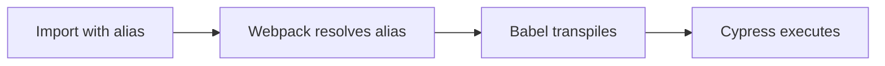

## What are Webpack Aliases?

Webpack aliases are shorthand paths that replace long relative imports with clean, absolute-style imports. Instead of writing `../../support/ui/homeTarget`, you can write `@ui/homeTarget`.

## Benefits

- **Cleaner Imports**: No more `../../../` path navigation
- **Refactor-Friendly**: Moving files doesn't break imports
- **Better Readability**: Intent is clear from the alias name
- **IDE Support**: IntelliSense and autocomplete work seamlessly

## Configuration

The project uses webpack to configure path aliases. This configuration is defined in `webpack.config.js`:

**File:** `webpack.config.js`

```javascript
const path = require('path');

module.exports = {
  mode: 'development',
  resolve: {
    alias: {
      '@ui': path.resolve(__dirname, 'cypress/support/ui'),
      '@tasks': path.resolve(__dirname, 'cypress/support/tasks'),
      '@questions': path.resolve(__dirname, 'cypress/support/questions'),
      '@utils': path.resolve(__dirname, 'cypress/support/utils')
    },
    extensions: ['.ts', '.js']
  },
  module: {
    rules: [
      {
        test: /\.js$/,
        exclude: /node_modules/,
        use: {
          loader: 'babel-loader' 
          // NOTE: Babel automatically reads .babelrc
        },
      },
    ],
  },
};
```

## Available Aliases

The project defines four main aliases:

<Accordion title="@ui">
  **Points to:** `cypress/support/ui/`

  **Purpose:** Import UI selectors and page objects

  **Example:**
  ```javascript
  import * as HomeUI from '@ui/homeTarget'
  import * as LoginUI from '@ui/loginTarget'
  import { JUGAR_GRATIS, IMAGE_POPPY } from '@ui/homeTarget'
  ```

  **Resolves to:**
  ```javascript
  // Without alias
  import * as HomeUI from '../../cypress/support/ui/homeTarget'
  ```
</Accordion>

<Accordion title="@tasks">
  **Points to:** `cypress/support/tasks/`

  **Purpose:** Import business logic and user action Tasks

  **Example:**
  ```javascript
  import * as Tasks from '@tasks/homeTask'
  import { click, showList, ElementCount } from '@tasks/homeTask'
  import * as LoginTasks from '@tasks/loginTask'
  ```

  **Resolves to:**
  ```javascript
  // Without alias
  import * as Tasks from '../../cypress/support/tasks/homeTask'
  ```
</Accordion>

<Accordion title="@questions">
  **Points to:** `cypress/support/questions/`

  **Purpose:** Import validation and assertion Questions

  **Example:**
  ```javascript
  import * as Quest from '@questions/elementQuest'
  import { ElementVisible, VisibleText } from '@questions/elementQuest'
  import * as LoginQuest from '@questions/loginQuest'
  ```

  **Resolves to:**
  ```javascript
  // Without alias
  import * as Quest from '../../cypress/support/questions/elementQuest'
  ```
</Accordion>

<Accordion title="@utils">
  **Points to:** `cypress/support/utils/`

  **Purpose:** Import helper functions and utilities

  **Example:**
  ```javascript
  import { CreateTask } from '@utils/imageEvidence'
  import * as DateUtils from '@utils/dateHelpers'
  ```

  **Resolves to:**
  ```javascript
  // Without alias
  import { CreateTask } from '../../cypress/support/utils/imageEvidence'
  ```
</Accordion>

## Usage Examples

### In Test Files

**File:** `cypress/e2e/checkElementHome.cy.js`

```javascript
import * as HomeUI from '@ui/homeTarget'
import * as Quest from '@questions/elementQuest' 
import * as Tasks from '@tasks/homeTask'

const FREE_ALIAS = 'gratisElement';
const NOW_ALIAS = 'ahoraElement';

describe('My first Cypress test', () => {
    beforeEach(() => {
        cy.visit('es-es');
    })

    it('search for elements on lol page', () => {
        Quest.ElementExit(HomeUI.JUGAR_GRATIS);
        Quest.ElementVisible(HomeUI.JUGAR_GRATIS);
        Quest.CheckImageType(HomeUI.IMAGE_POPPY, 'jpg');
        Tasks.ElementCount(HomeUI.DIVS_ELEMENT, 'Jugar gratis', FREE_ALIAS);
        Tasks.ElementCount(HomeUI.DIVS_ELEMENT, 'Jugar ahora', NOW_ALIAS);
        Quest.CheckElementNumber(NOW_ALIAS, 3);
    });
});
```

### In Task Files

**File:** `cypress/support/tasks/homeTask.js`

```javascript
import {CreateTask} from '@utils/imageEvidence'

export const showList = CreateTask('Desplegar lista de opciones', (elementSelector, textElement) => {
    cy.log(`Thinking: dar click sobre boton {${textElement}}`);
    cy.get(elementSelector).contains(textElement).realHover();
});
```

### In Question Files

**File:** `cypress/support/questions/elementQuest.js`

```javascript
import {CreateTask} from '@utils/imageEvidence'

export const ElementExit = CreateTask('Verificar que el elemento exista', (elementSelector) => {
    cy.log(`Thinking: Verificando que el elemento ${elementSelector} ya existe...`);
    return cy.get(elementSelector)
      .scrollIntoView({ block: 'center', inline: 'center' })
      .first()
      .should('exist');
});
```

## Import Patterns

<CodeGroup>
```javascript Wildcard Import (Recommended)
// Import all exports as a namespace
import * as HomeUI from '@ui/homeTarget'
import * as Quest from '@questions/elementQuest'
import * as Tasks from '@tasks/homeTask'

// Usage
Quest.ElementVisible(HomeUI.JUGAR_GRATIS);
Tasks.click(HomeUI.BUTTON_GUARDAR, 'Save');
```

```javascript Named Import
// Import specific exports
import { JUGAR_GRATIS, IMAGE_POPPY } from '@ui/homeTarget'
import { ElementVisible, VisibleText } from '@questions/elementQuest'
import { click, showList } from '@tasks/homeTask'

// Usage
ElementVisible(JUGAR_GRATIS);
click(IMAGE_POPPY, 'Click here');
```

```javascript Mixed Import
// Combine both patterns
import * as Quest from '@questions/elementQuest'
import { CreateTask } from '@utils/imageEvidence'

// Define custom task
export const customTask = CreateTask('My custom task', () => {
    // Task logic
});
```
</CodeGroup>

## IDE Configuration

To enable IntelliSense and autocomplete in your IDE, the project includes a `jsconfig.json` file:

**File:** `jsconfig.json`

```json
{
  "compilerOptions": {
    "baseUrl": ".",
    "paths": {
      "@ui/*": ["cypress/support/ui/*"],
      "@tasks/*": ["cypress/support/tasks/*"],
      "@questions/*": ["cypress/support/questions/*"],
      "@utils/*": ["cypress/support/utils/*"]
    }
  },
  "include": ["cypress/**/*"]
}
```

<Note>
  The `jsconfig.json` configuration mirrors the webpack aliases to ensure your IDE understands the path mappings.
</Note>

## How It Works

1. **Webpack processes imports** during the build/test phase
2. **Aliases are resolved** to their full paths using the configuration
3. **Babel transpiles** the code (reading from `.babelrc`)
4. **Cypress executes** the resolved code



## Integration with Cypress

The webpack configuration is integrated with Cypress through the `cypress.config.js` file:

```javascript
const { defineConfig } = require('cypress');
const webpack = require('@cypress/webpack-preprocessor');
const webpackOptions = require('./webpack.config.js');

module.exports = defineConfig({
  e2e: {
    setupNodeEvents(on, config) {
      on('file:preprocessor', webpack({ webpackOptions }));
    },
  },
});
```

This tells Cypress to use webpack as a preprocessor for all test files.

## Best Practices

<Accordion title="Use Consistent Import Patterns">
  Choose either wildcard or named imports and stick with it throughout your project:

  ```javascript
  // Recommended - wildcard imports
  import * as HomeUI from '@ui/homeTarget'
  import * as Quest from '@questions/elementQuest'
  import * as Tasks from '@tasks/homeTask'
  ```

  This makes it clear where each function comes from.
</Accordion>

<Accordion title="Organize Files by Feature">
  Structure your support files to match your application's features:

  ```
  cypress/support/
  ├── ui/
  │   ├── homeTarget.js
  │   ├── loginTarget.js
  │   └── dashboardTarget.js
  ├── tasks/
  │   ├── homeTask.js
  │   ├── loginTask.js
  │   └── dashboardTask.js
  └── questions/
      ├── homeQuest.js
      ├── loginQuest.js
      └── dashboardQuest.js
  ```

  This organization works well with aliases.
</Accordion>

<Accordion title="Avoid Deep Nesting">
  Keep alias paths flat. Instead of:

  ```javascript
  // Avoid
  '@ui/pages/home/components'
  ```

  Use:

  ```javascript
  // Better
  '@ui/homeComponents'
  ```
</Accordion>

<Accordion title="Document Custom Aliases">
  If you add new aliases, document them in your project README and update `jsconfig.json` for IDE support.
</Accordion>

## Troubleshooting

<Accordion title="Import not found">
  **Problem:** IDE shows "Cannot find module '@ui/homeTarget'"

  **Solution:**
  1. Verify `jsconfig.json` exists and matches webpack aliases
  2. Restart your IDE
  3. Check that the file exists at `cypress/support/ui/homeTarget.js`
</Accordion>

<Accordion title="Tests fail with module error">
  **Problem:** Cypress throws "Cannot resolve module '@tasks/homeTask'"

  **Solution:**
  1. Verify `webpack.config.js` is correctly configured
  2. Check that Cypress is using the webpack preprocessor
  3. Ensure the file exists at the resolved path
</Accordion>

<Accordion title="Autocomplete not working">
  **Problem:** IDE doesn't provide autocomplete for aliased imports

  **Solution:**
  1. Check `jsconfig.json` configuration
  2. Ensure paths use glob patterns (e.g., `@ui/*`)
  3. Reload your IDE window
</Accordion>

<Tip>
  When adding new directories to `cypress/support/`, create corresponding webpack aliases to maintain consistency across the project.
</Tip>
