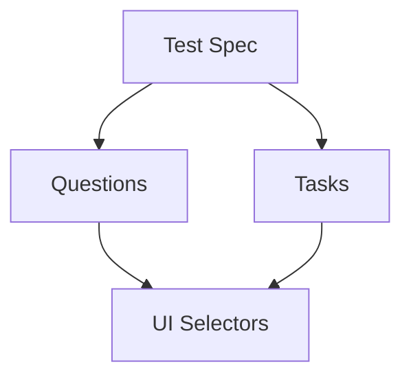

## Architecture Overview

This project follows a three-layer pattern inspired by the Screenplay pattern:

- **UI Selectors** (`@ui/*Target.js`) - CSS selectors for page elements
- **Tasks** (`@tasks/*Task.js`) - Actions that users perform
- **Questions** (`@questions/*Quest.js`) - Assertions about the application state



## UI Selectors (Targets)

UI Selectors are exported constants that define CSS selectors for page elements. They centralize element identification, making tests easier to maintain.

### Structure

Located in `cypress/support/ui/` directory with the pattern `*Target.js`.

### Example: homeTarget.js

```javascript homeTarget.js
export const JUGAR_GRATIS = 'div[class="top-content"]  a[role="button"]  div[data-testid="cta-content"]';
export const BUTTON_GUARDAR = 'div[role="dialog"] button[class*="type_save"]';
export const IMAGE_POPPY = 'a[aria-label^="Versión 16.6"] img[data-testid="mediaImage"]';
export const ASSASIN_AKALY = 'section[data-testid="blade"] div[class="icon-tab-media-subtitle"]';
export const DIVS_ELEMENT = 'div[class="cta-content"]';
export const NOTICIAS_LIST = '[data-testid$="internal-news"] > p';
export const NOTICIAS_ELEMENT = '[data-testid$="internal-news"]  a[data-testid^="riotbar:desktopNav:link-"]';
```

### Selector Best Practices

<Steps>
  <Step title="Prefer data-testid Attributes">
    Use `data-testid` attributes when available for stable, test-specific selectors:
    ```javascript
    export const IMAGE_POPPY = 'img[data-testid="mediaImage"]';
    ```
  </Step>

  <Step title="Use Attribute Selectors">
    Leverage CSS attribute selectors for dynamic content:
    ```javascript
    // Starts with
    export const IMAGE_POPPY = 'a[aria-label^="Versión 16.6"]';
    
    // Ends with
    export const NOTICIAS_LIST = '[data-testid$="internal-news"]';
    
    // Contains
    export const BUTTON_GUARDAR = 'button[class*="type_save"]';
    ```
  </Step>

  <Step title="Combine Selectors for Specificity">
    Chain selectors to target nested elements precisely:
    ```javascript
    export const JUGAR_GRATIS = 'div[class="top-content"]  a[role="button"]  div[data-testid="cta-content"]';
    ```
  </Step>
</Steps>

### Creating Dynamic Selectors

For elements that require dynamic values, export functions:

```javascript historyTarget.js
export const BUTTON = (text) => `button:contains("${text}")`;
export const LORE_ASHE = '[data-testid="lore-ashe"]';
export const ASHE_IMAGE = '[data-testid="ashe-hero-image"]';
```

Usage:
```javascript
Tasks.SearchElement(Ui.LORE_ASHE, Ui.BUTTON('VER MÁS'), ASHE_ALIAS);
```

### Importing UI Selectors

<CodeGroup>

```javascript Named Imports
import {
    NOTICIAS_LIST,
    NOTICIAS_ELEMENT
} from '@ui/homeTarget'
```

```javascript Namespace Import
import * as HomeUI from '@ui/homeTarget'

// Usage
Quest.ElementExit(HomeUI.JUGAR_GRATIS);
Quest.CheckImageType(HomeUI.IMAGE_POPPY, 'jpg');
```

</CodeGroup>

## Tasks

Tasks represent actions that users perform. They encapsulate complex interactions and provide semantic meaning to test code.

### Structure

Located in `cypress/support/tasks/` directory with the pattern `*Task.js`.

### Example: homeTask.js

```javascript homeTask.js
import {CreateTask} from '@utils/imageEvidence'

/**
 * Count the number of elements with the same text value.
 * @example
 * ElementCount('#mi-boton', textValue, alias)
 * ElementCount('.btn-primary', textValue, alias)
 * ElementCount('[data-testid="login"]', textValue, alias)
 */
export const ElementCount = (elementSelector, keyWord, alias) => {
    cy.log(`Thinking: encontrar numero de elementos ${elementSelector} que tienen en su texto {${keyWord}} y sea visible...`)
    cy.get(elementSelector) 
      .filter(`:contains(${keyWord})`) 
      .filter(':visible')            
      .its('length')
      .as(alias) 
}

/**
 * Show list of elements linked to webElement
 * @example
 * showList('#mi-boton', textValue)
 * showList('[data-testid="login"]', textValue)
 */
export const showList = CreateTask('Desplegar lista de opciones', (elementSelector, textElement) => {
    cy.log(`Thinking: dar click sobre boton {${textElement}}`);
    cy.get(elementSelector).contains(textElement).realHover();
});

/**
 * Click in a webElement
 * @example
 * click('#mi-boton', textValue)
 * click('[data-testid="login"]', textValue)
 */
export const click = (elementSelector, textElement) => {
    cy.log(`Thinking: dar click sobre boton {${textElement}}`);
    cy.get(elementSelector).contains(textElement).click();
}
```

### Using Tasks in Tests

```javascript
import * as Tasks from '@tasks/homeTask'
import * as HomeUI from '@ui/homeTarget'

it('buscar elementos en pag lol', () => {
    Tasks.ElementCount(HomeUI.DIVS_ELEMENT, 'Jugar gratis', FREE_ALIAS);
    Tasks.ElementCount(HomeUI.DIVS_ELEMENT, 'Jugar ahora', NOW_ALIAS);
});

it('buscar elementos en listas', () => {
    Tasks.showList(HomeUI.NOTICIAS_LIST, NEWS);
});
```

### CreateTask Utility

The `CreateTask` wrapper adds automatic evidence capture:

```javascript
export const showList = CreateTask('Desplegar lista de opciones', (elementSelector, textElement) => {
    cy.log(`Thinking: dar click sobre boton {${textElement}}`);
    cy.get(elementSelector).contains(textElement).realHover();
});
```

<Note>
  **CreateTask Benefits**
  - Automatically captures screenshots after task execution
  - Adds semantic logging to the Cypress runner
  - Provides consistent task naming
</Note>

## Questions

Questions represent assertions about the application state. They verify that the UI is in the expected condition.

### Structure

Located in `cypress/support/questions/` directory with the pattern `*Quest.js`.

### Example: elementQuest.js

```javascript elementQuest.js
import {CreateTask} from '@utils/imageEvidence'

/**
 * Verify the element exists in the DOM.
 * @example
 * ElementExit('#mi-boton')
 * ElementExit('.btn-primary')
 * ElementExit('[data-testid="login"]')
 */
export const ElementExit = CreateTask('Verificar que el elemento exista', (elementSelector) => {
    cy.log(`Thinking: Verificando que el elemento ${elementSelector} ya existe...`);
    return cy.get(elementSelector)
      .scrollIntoView({ block: 'center', inline: 'center' })
      .first()
      .should('exist');
});

/**
 * Verify the element is visible in the DOM.
 * @example
 * ElementVisible('#mi-boton')
 * ElementVisible('[data-testid="login"]')
 * ElementVisible(AliasDefinido)
 */
export const ElementVisible = CreateTask('Verificar que el elemento sea visible', (elementSelector) => {
    cy.log(`Thinking: Verificando que el elemento ${elementSelector} es visible ...`);
    return cy.get(elementSelector)
      .scrollIntoView({ block: 'center', inline: 'center' })
      .first()
      .should('be.visible');
});

/**
 * Verify the text is visible in the DOM.
 * @example
 * VisibleText('#mi-boton', keyWord)
 * VisibleText('[data-testid="login"]', keyWord)
 */
export const VisibleText = CreateTask('Verificar que el texto sea visible', (elementSelector, keyWord) => {
    cy.log(`Thinking: Verificando que el elemento ${elementSelector} contenga el texto {${keyWord}} y sea visible...`);
    return cy.get(elementSelector)
      .contains(keyWord)
      .first()
      .scrollIntoView({ block: 'center', inline: 'center' })
      .should('be.visible');
});

/**
 * Verify the element type image is visible in the DOM.
 * @example
 * CheckImageType('#mi-boton', 'jpg')
 * CheckImageType('[data-testid="image"]', 'png')
 */
export const CheckImageType = CreateTask('Verificar que el elemento sea una imagen de tipo', (elementSelector, imageType) => {
    cy.log(`Thinking: Verificando que el elemento ${elementSelector} sea una imagen de tipo {${imageType}} y sea visible...`);
    cy.get(elementSelector)
      .should('be.visible') 
      .and('have.attr', 'src') 
      .and('include', imageType);
});

/**
 * Verify the number of elements matches expected count.
 * @example
 * CheckElementNumber(aliasNumberElement, expectedNumber)
 */
export const CheckElementNumber = (Alias, numberElement) => {
    cy.log(`Thinking: Verificando que el numero de elementos visibles sea el correcto ...`);
    cy.get(`@${Alias}`)
      .should('equal', numberElement);
}
```

### Using Questions in Tests

```javascript
import * as Quest from '@questions/elementQuest'
import * as HomeUI from '@ui/homeTarget'

it('buscar elementos en pag lol', () => {
    Quest.ElementExit(HomeUI.JUGAR_GRATIS);
    Quest.ElementVisible(HomeUI.JUGAR_GRATIS);
    Quest.CheckImageType(HomeUI.IMAGE_POPPY, 'jpg');
    Quest.VisibleText(HomeUI.ASSASIN_AKALY, 'La Asesina Sigilosa');
    Quest.CheckElementNumber(NOW_ALIAS, 3);
    Quest.CheckElementNumber(FREE_ALIAS, 2);
});
```

## Complete Test Example

Here's how all three layers work together:

```javascript checkElementHome.cy.js
import * as HomeUI from '@ui/homeTarget'
import * as Quest from '@questions/elementQuest' 
import * as Tasks from '@tasks/homeTask'

const HISTORY = 'HISTORIAS';
const NEWS = 'Noticias';
const FREE_ALIAS = 'gratisElement';
const NOW_ALIAS = 'ahoraElement';

describe('Mi primera prueba en Cypress', () => {
    beforeEach(() => {
        cy.visit('es-es');
    });

    it('buscar elementos en pag lol', () => {
        // Questions - Verify state
        Quest.ElementExit(HomeUI.JUGAR_GRATIS);
        Quest.ElementVisible(HomeUI.JUGAR_GRATIS);
        Quest.CheckImageType(HomeUI.IMAGE_POPPY, 'jpg');
        Quest.VisibleText(HomeUI.ASSASIN_AKALY, 'La Asesina Sigilosa');
        
        // Tasks - Perform actions
        Tasks.ElementCount(HomeUI.DIVS_ELEMENT, 'Jugar gratis', FREE_ALIAS);
        Tasks.ElementCount(HomeUI.DIVS_ELEMENT, 'Jugar ahora', NOW_ALIAS);
        
        // Questions - Verify results
        Quest.CheckElementNumber(NOW_ALIAS, 3);
        Quest.CheckElementNumber(FREE_ALIAS, 2);
    });

    it('buscar elementos en listas', () => {
        // Questions - Initial state
        Quest.VisibleText(HomeUI.NOTICIAS_LIST, NEWS);
        Quest.ElementNotVisible(HomeUI.NOTICIAS_ELEMENT, HISTORY);
        Quest.ElementNotExit(HomeUI.NOTICIAS_ELEMENT, 'PATRICIO');
        
        // Tasks - User action
        Tasks.showList(HomeUI.NOTICIAS_LIST, NEWS);
        
        // Questions - Verify state change
        Quest.VisibleText(HomeUI.NOTICIAS_ELEMENT, HISTORY);
    });
});
```

## Benefits of This Pattern

<Warning>
  **Maintainability**
  
  When selectors change, update only the UI Target file - all tests automatically use the new selector:
  ```javascript
  // Before
  export const JUGAR_GRATIS = 'div.old-class a';
  
  // After - only one change needed
  export const JUGAR_GRATIS = 'div.new-class a';
  ```
</Warning>

<Note>
  **Readability**
  
  Tests read like plain English:
  ```javascript
  Quest.ElementVisible(HomeUI.JUGAR_GRATIS);
  Quest.CheckImageType(HomeUI.IMAGE_POPPY, 'jpg');
  Tasks.showList(HomeUI.NOTICIAS_LIST, NEWS);
  ```
</Note>

### Key Advantages

1. **Separation of Concerns**: Selectors, actions, and assertions are separated
2. **Reusability**: Share Tasks and Questions across multiple tests
3. **Consistency**: Standardized approach to element interaction
4. **Documentation**: JSDoc comments provide inline documentation
5. **Debugging**: Semantic logging makes test failures easier to understand

## Path Aliases

The project uses webpack aliases for clean imports:

```javascript
import * as HomeUI from '@ui/homeTarget'
import * as Quest from '@questions/elementQuest' 
import * as Tasks from '@tasks/homeTask'
```

Configured in `webpack.config.js`:
```javascript
resolve: {
  alias: {
    '@ui': path.resolve(__dirname, 'cypress/support/ui'),
    '@tasks': path.resolve(__dirname, 'cypress/support/tasks'),
    '@questions': path.resolve(__dirname, 'cypress/support/questions'),
    '@utils': path.resolve(__dirname, 'cypress/support/utils'),
  }
}
```